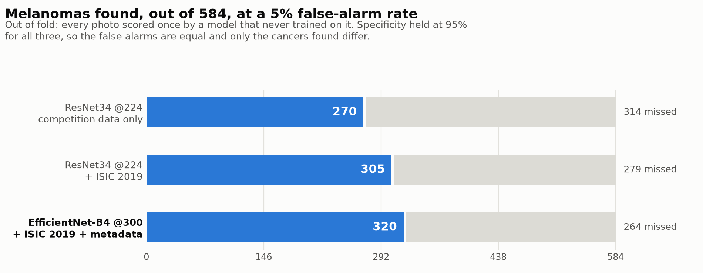

# Melanoma Classification

Binary classifier for dermoscopic skin lesion images. Feed it one JPEG, it returns the probability that the lesion is melanoma.

## Overview

Melanoma is the skin cancer that actually kills people. It is also rare compared to the benign moles it resembles, and the visual gap between an early melanoma and an ordinary nevus is small enough that trained dermatologists disagree with each other. A model that scores a dermoscopic photo is a triage aid. It sorts a queue, it does not make a diagnosis.

The SIIM-ISIC data is hard for reasons that have little to do with which network you pick. Only 1.76% of the training rows are malignant, so a model that answers "benign" every time scores 98.2% accuracy and is worthless. The images come from many different cameras and clinics, with resolutions running from 640x480 up to 6000x4000 in the same training set. Patients repeat, heavily: one patient contributes 115 images. Split the rows at random and the same person's skin lands on both sides of the split, which quietly inflates every validation number you look at.

The repository holds the whole pipeline: exploratory analysis in [notebooks/eda.ipynb](notebooks/eda.ipynb), five preprocessing steps, a ResNet34 baseline, and a multi-modal EfficientNet final model that has been trained across five patient-grouped folds. Four write-ups in [reports/](reports/) carry the findings and are not restated here:

| Report | What it covers |
|---|---|
| [EDA_Report.md](reports/EDA_Report.md) | class balance, patient overlap, missingness, resolution spread |
| [Preprocessing_Report.md](reports/Preprocessing_Report.md) | the five preprocessing steps and why each one exists |
| [Experiment_Report.md](reports/Experiment_Report.md) | the baseline, and the paired test of whether ISIC 2019 helps |
| [Final_Report.md](reports/Final_Report.md) | the final architecture, its numbers, and what is still missing |

The one thing still marked TODO below is genuinely unknown rather than unwritten.

## Dataset

SIIM-ISIC Melanoma Classification, from the 2020 Kaggle competition.

| Split | Rows | Metadata columns |
|---|---|---|
| train | 33,126 | 8 |
| test | 10,982 | 5 |

Class balance in the training set:

| target | label | count | share |
|---|---|---|---|
| 0 | benign | 32,542 | 98.24% |
| 1 | malignant | 584 | 1.76% |

Metadata columns are `image_name`, `patient_id`, `sex`, `age_approx`, `anatom_site_general_challenge`, `diagnosis`, `benign_malignant`, `target`. The test set drops the last three.

Images vary in resolution across the dataset, so everything gets resized to a fixed input size during preprocessing. Metadata has some missing values in `sex`, `age_approx`, and `anatom_site_general_challenge`. Many patients contribute more than one image, which drives the split strategy described under Approach.

### Getting the data

Images are not in this repository. `data/` is in [.gitignore](.gitignore) and the raw download is far too large for git.

```bash
pip install kaggle
# put your kaggle.json in ~/.kaggle/ first, and accept the competition rules on the website
kaggle competitions download -c siim-isic-melanoma-classification -p data/raw
unzip data/raw/siim-isic-melanoma-classification.zip -d data/raw
```

Expected layout after unzipping:

```
data/
  raw/
    train.csv
    test.csv
    jpeg/
      train/          # ISIC_0015719.jpg, ...
      test/
```

The notebook reads these as `../data/raw/train.csv` and `../data/raw/jpeg/train`, relative to `notebooks/`. Download size on disk: TODO.

## Approach

**Baseline.** ImageNet-pretrained ResNet34 at 224x224, 10 epochs, `BCEWithLogitsLoss` with `pos_weight` computed per split. [src/train_baseline.py](src/train_baseline.py). Scores ROC-AUC 0.887.

**Final architecture.** [src/models/final_model.py](src/models/final_model.py). An EfficientNet-B4 at 300x300, GeM-pooled, with the patient's sex, age and body site fused into the image features through a gated residual, so noisy metadata can add nothing but can never wipe out the image branch. Trained in two stages (backbone frozen while the fresh head settles, then differential learning rates with warmup into cosine decay), with mixup, cutmix and flip test-time augmentation. Scores ROC-AUC 0.909. Full description in [reports/Final_Report.md](reports/Final_Report.md).

**Why transfer learning.** 584 positive examples is not enough to learn edges, texture, and color from scratch. A pretrained backbone arrives already knowing those, so training only has to learn what separates a melanoma from a nevus. It also cuts training time to something four students can iterate on.

**Validation split.** Group by `patient_id`, using `StratifiedGroupKFold` or `GroupKFold` from scikit-learn, so that no patient appears in both the training and validation folds.

This matters more here than in a typical image task. 2,056 patients contribute multiple images and one contributes 115. Under a random row split, a model can memorize a patient's skin tone, hair pattern, ruler markings, and camera artifacts from their training images, then recognize the same patient in validation and score their remaining lesions correctly for the wrong reason. Validation AUC goes up, real performance does not. Grouping by patient forces the model to generalize to skin it has never seen.

Stratification on `target` is still needed on top of the grouping. At 1.76% positive, an unstratified fold can end up with almost no malignant cases in it.

**Class imbalance handling.** `BCEWithLogitsLoss` with `pos_weight` computed from each training split, which comes out at about 9.4 with the external data and 55.7 without. Hardcoding it, as an earlier version did, is wrong by a factor of six for the dataset actually in use. A focal loss is implemented in [src/losses/focal_loss.py](src/losses/focal_loss.py) but the final run did not use it.

**External data.** ISIC 2019 is added to training only, never to a validation fold, and the training scripts assert this. It is worth about +0.041 PR-AUC on the baseline, five folds out of five. See [reports/Experiment_Report.md](reports/Experiment_Report.md).

**Folds, image size, schedule.** 5 folds, `StratifiedGroupKFold` on `patient_id`. 512-pixel images on disk, resized to the model's input at load time. 12 epochs for the final model, 2 of them with the backbone frozen. Seed fixed at 42 everywhere.

## Results

Five-fold cross-validation, folds grouped by `patient_id`, ISIC 2019 in training only. Every number below is **out of fold**: all 33,126 competition photos, each scored exactly once by the fold model that did not train on it.

| Model | ROC-AUC | PR-AUC | Sens @ 95% spec | Notes |
|---|---|---|---|---|
| Random guessing | 0.500 | 0.0176 | 0.050 | the floor at a 1.76% positive rate |
| ResNet34 @224, no external | 0.879 | 0.170 | 0.462 | competition data only |
| ResNet34 @224, + ISIC 2019 | 0.886 | 0.216 | 0.522 | the baseline |
| **EfficientNet-B4 @300 + metadata** | **0.9076** | **0.2507** | **0.5479** | the final model |


The final model beats the baseline on all five folds on both AUCs. The gain is small per fold but it never once goes the other way, which is the evidence that matters at five samples.

What that means in cancers rather than decimals:



ROC-AUC is the competition metric, but at 1.76% positives it is generous. PR-AUC and sensitivity at a fixed specificity are the numbers that say whether the model is useful, so all three are reported. Read the sensitivity number.

**Where it fails.** At that operating point the model still misses 264 of the 584 melanomas, and 12 of them it scores below 0.01, which is a confident wrong answer rather than a near miss. In the other direction, 118 benign lesions score above 0.90. The [final report](reports/Final_Report.md) names the worst cases image by image.

One caveat worth knowing before you read the tables: test-time augmentation was applied only on the last three epochs while the checkpoint was selected across all twelve, which biases which epoch gets picked. It does not affect the out-of-fold score above, which is measured on predictions rather than on the selection rule. The final report covers it in full.

Raw numbers: [reports/results.csv](reports/results.csv) (baseline), [reports/final_results.csv](reports/final_results.csv) (per fold), [reports/final_oof.csv](reports/final_oof.csv) (every photo). Both figures rebuild with `python src/make_figures.py`.

## Quickstart

**Read this first:** `predict.py` and published weights are still missing. Training and evaluation work today; single-image inference does not. Everything below is honest about which is which.

Clone:

```bash
git clone https://github.com/Harut200/melanoma-classification.git
cd melanoma-classification
```

Create a virtual environment. Python 3.12:

```bash
python3.12 -m venv .venv
source .venv/bin/activate         # Windows: .venv\Scripts\activate
pip install -r requirements.txt
```

The code is PyTorch. `requirements.txt` pins torch, torchvision, timm and albumentations alongside pandas, numpy, scipy, scikit-learn, matplotlib, seaborn, opencv-python, kaggle, jupyter and tqdm. On an NVIDIA machine install torch from the CUDA index instead of PyPI:

```bash
pip install torch torchvision --index-url https://download.pytorch.org/whl/cu124
```

### Preprocessing

Five steps, documented in [docs/preprocessing.md](docs/preprocessing.md). They take the raw Kaggle download to 512-pixel images plus a `metadata_clean.csv` carrying patient-grouped folds and the encoded sex/site/age columns the final model needs.

```bash
python src/step1_download.py        # pull from Kaggle
python src/step2_make_folds.py      # clean metadata, StratifiedGroupKFold on patient_id
python src/step3_resize_images.py   # resize to 512, remove hair
python src/step4_add_external.py    # add ISIC 2019
python src/step5_package.py         # pack it for upload
```

### Training

The baseline, and the ISIC 2019 ablation:

```bash
python src/experiment_runner.py \
    --img_dir data/processed/train_512 \
    --folds_csv data/processed/folds.csv \
    --out_dir reports \
    --only resnet34_224_ext,resnet34_224_noext \
    --folds 0,1,2,3,4

python src/report_results.py --in_dir reports
```

The final model, five folds with TTA and out-of-fold predictions:

```bash
python src/run_final_kaggle.py \
    --img_dir data/processed/train_512 \
    --metadata_csv data/processed/metadata_clean.csv \
    --out_dir reports \
    --backbone tf_efficientnet_b4 \
    --image_size 300 \
    --folds 0,1,2,3,4 \
    --epochs 12 \
    --tta 4 \
    --save_weights

python src/final_report.py --in_dir reports
```

Both runners append each finished fold to their results CSV and skip what is already there on a restart, which matters because the final run is measured in hours.

Hardware and runtime, on a Kaggle T4: baseline 22 minutes a fold, 1.9 GPU hours for all ten runs. Final model 139 minutes a fold, 11.6 GPU hours for five. Kaggle allows two concurrent GPU sessions, so splitting the folds across two notebooks roughly halves the wall clock. Use T4, not P100. Current PyTorch builds no longer compile for Pascal and a P100 reports `cuda.is_available() == True` before failing on the first kernel launch.

On Kaggle, use the notebooks in [kaggle/](kaggle/) rather than the commands above.

### Single-image inference

[predict.py](predict.py) loads saved weights and scores one photo. It never trains anything.

```bash
python predict.py --image path/to/lesion.jpg
```

```
  Image        ISIC_8306697.jpg
  Model        tf_efficientnet_b4 @300px, 5-fold ensemble, 4x flip TTA

  Prediction:  MALIGNANT (melanoma) | Confidence: 96.1%

  Melanoma probability   0.9610
  Decision threshold     0.6245
  Risk band              HIGH - refer urgently
  Fold agreement         0.0921 spread across 5 models
  Took                   0.89s
```

`ISIC_8306697` is a confirmed melanoma and the model calls it correctly. One caveat
worth stating, because it is the sort of thing that should not be quietly skipped:
this photo sits in fold 3, so four of those five fold models trained on it. Only the
fold 3 model never saw it, and its honest out-of-fold probability for this image is
**0.9974**, recorded in [reports/final_oof.csv](reports/final_oof.csv). Every headline
number in the Results section above is out-of-fold and carries no such overlap; this
one demo output does, and the ensemble is shown because it is what the script runs by
default.

The model also takes the patient's details, which is what the metadata branch is for. Anything you leave out becomes the `unknown` category, which it was trained to handle because a tenth of the real dataset is missing it too:

```bash
python predict.py --image lesion.jpg --sex male --age 55 --site torso
```

Point `--weights` at a folder and it averages the fold models, which is the configuration the reported numbers describe. Point `--image` at a folder and add `--csv out.csv` to score a batch.

```bash
python predict.py --image lesion.jpg --weights models/          # 5-fold ensemble
python predict.py --image photos/ --csv predictions.csv         # batch
```

Two things it does deliberately:

**The preprocessing is imported from the training code, not reimplemented.** Centre square crop, resize to 512, DullRazor hair removal, resize to the model's input, ImageNet normalisation, using the same functions `step3_resize_images.py` and `MelanomaDataset` use. If inference preprocessing drifts from training preprocessing the model is being shown a distribution it never saw, and nothing in the output would tell you.

**It refuses a broken checkpoint instead of predicting from it.** BatchNorm stores the running variance of its input, and real photos always give a positive variance. A layer sitting at zero means every training image was identical, which is exactly what the old black-square bug produced (see [reports/Experiment_Report.md](reports/Experiment_Report.md)). Those checkpoints load without complaint and then return probability 1.0000 for anything, including a photo of a leaf. `predict.py` checks for it and stops.

Weights are not in the repository. They are large binaries and `.gitignore` excludes them. Train with `--save_weights`, or download the fold checkpoints from the Kaggle run into `models/`.

### The EDA notebook

```bash
jupyter notebook notebooks/eda.ipynb
```

It needs `data/raw/` populated. Most cells fail without it.

## Repository structure

```
melanoma-classification/
├── README.md
├── predict.py              # single-image inference, loads saved weights
├── requirements.txt        # pinned, PyTorch, Python 3.12
├── run_all.sh              # the preprocessing steps end to end
├── run_colab.py            # Colab runner for the final model
├── configs/
├── data/                   # git-ignored, downloaded from Kaggle
├── docs/
│   ├── preprocessing.md
│   └── external_data_roadmap.md
├── kaggle/
│   ├── melanoma_experiments.ipynb   # baseline and the ISIC 2019 ablation
│   └── final_model_kaggle.ipynb     # the final model, five folds
├── notebooks/
│   ├── eda.ipynb
│   └── experiments.ipynb
├── reports/
│   ├── EDA_Report.md / .pdf
│   ├── Preprocessing_Report.md
│   ├── Experiment_Report.md
│   ├── Final_Report.md
│   ├── results.csv                  # baseline, one row per model per fold
│   ├── final_results.csv            # final model, one row per fold
│   └── figures/
└── src/
    ├── step1_download.py            # preprocessing, five steps
    ├── step2_make_folds.py
    ├── step3_resize_images.py
    ├── step4_add_external.py
    ├── step5_package.py
    ├── dataset.py                   # image loading, normalisation, metadata columns
    ├── metrics.py                   # PR-AUC, threshold search, sensitivity at fixed specificity
    ├── models/
    │   ├── baseline_models.py
    │   └── final_model.py           # GeM + tabular embeddings + gated fusion
    ├── losses/focal_loss.py         # implemented, not used by the final run
    ├── train_baseline.py
    ├── train_final.py               # two-stage fine tuning, single fold
    ├── experiment_runner.py         # baseline sweep across folds, crash safe
    ├── run_final_kaggle.py          # final model across folds, TTA, out-of-fold preds
    ├── bench_backbones.py           # images/sec per backbone, to size a run
    ├── evaluate_test.py             # score a held-out fold from saved weights
    ├── ensemble_oof.py              # rank-average out-of-fold predictions across runs
    ├── report_results.py            # baseline report
    └── final_report.py              # final model report, out-of-fold, ensemble
```

`configs/` is empty: every run is driven by command-line flags rather than a config file. Trained weights are not committed. They are large binaries and `.gitignore` excludes them.

## Notes and limitations

**This is not a medical device and is not for clinical use.** It is a student project built for a Picsart Academy course. Do not use it to decide anything about a real mole on a real person. If something on your skin is changing, see a dermatologist.

The model, once trained, will only be valid on dermoscopic images: close-up photos taken through a dermatoscope against the skin. Phone camera snapshots are a different distribution and predictions on them mean nothing.

The ISIC archive skews heavily toward light skinned patients from a handful of clinics in the US, Australia, and Europe. Melanoma presents differently on darker skin, and is more often diagnosed late. A model trained on this data should be assumed to perform worse on skin tones the data barely contains, and this repository does not measure that gap because the metadata does not record skin tone.

At 1.76% positives, a high ROC-AUC can coexist with missing most of the melanomas at any threshold you would actually deploy. Read the sensitivity number, not the AUC.

The `diagnosis` column is mostly `unknown` for benign lesions, so the labels are coarser than they look. `benign_malignant` and `target` carry the same information, just in different formats.

The metadata has gaps and at least one implausible age value. Whatever the model does with the metadata features has to tolerate missing and wrong entries. See the notebook for the details.

The reported numbers are best-epoch-on-the-validation-fold, which is normal for picking a checkpoint but slightly optimistic. No fold was held back untouched. [src/evaluate_test.py](src/evaluate_test.py) supports a genuinely clean split and has not been run.

The model's output probabilities are not calibrated. `pos_weight` deliberately pushes them upward, so 0.5 means nothing; the per-fold tuned thresholds land between 0.447 and 0.679. A deployment threshold has to be picked from pooled out-of-fold predictions, which have not been collected yet.

Still unmeasured: generalization to cameras and clinics outside the ISIC archive, and behavior on lesion types absent from the training set.

## Team

Final project, Picsart Academy.

- Ruzanna Barseghyan
- Anahit Tumasyan
- Mariam Petrosyan
- Harutyun Kesablyan
